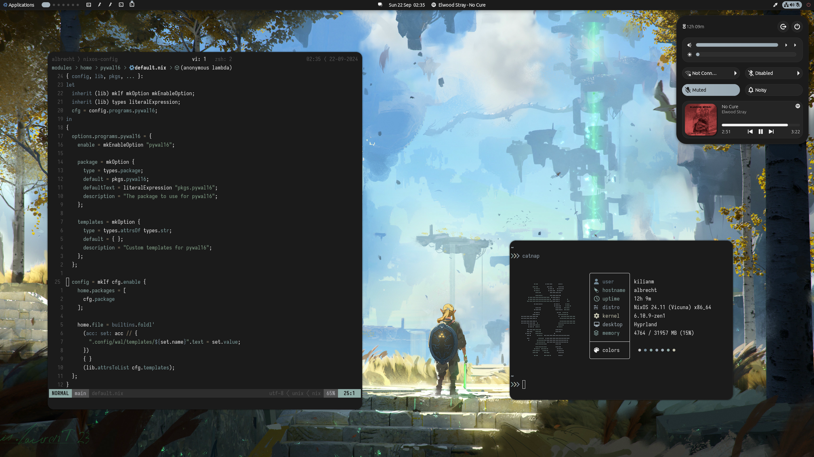
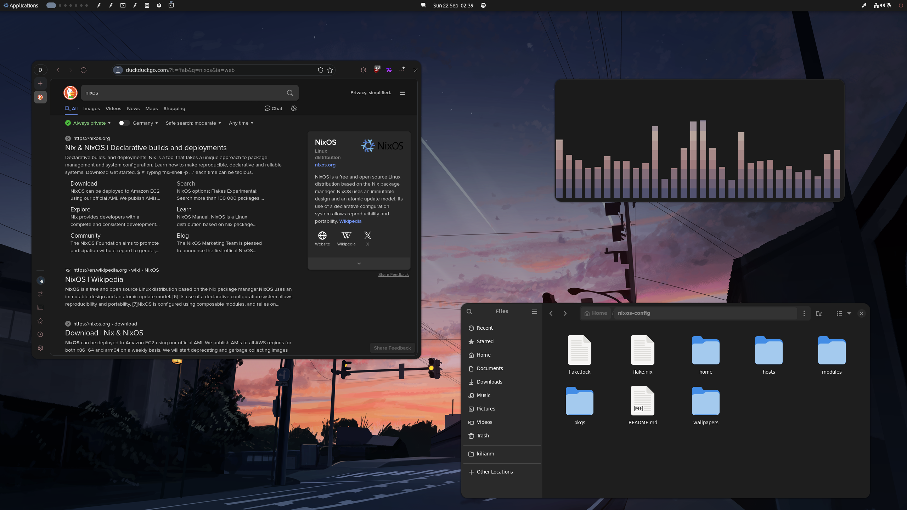
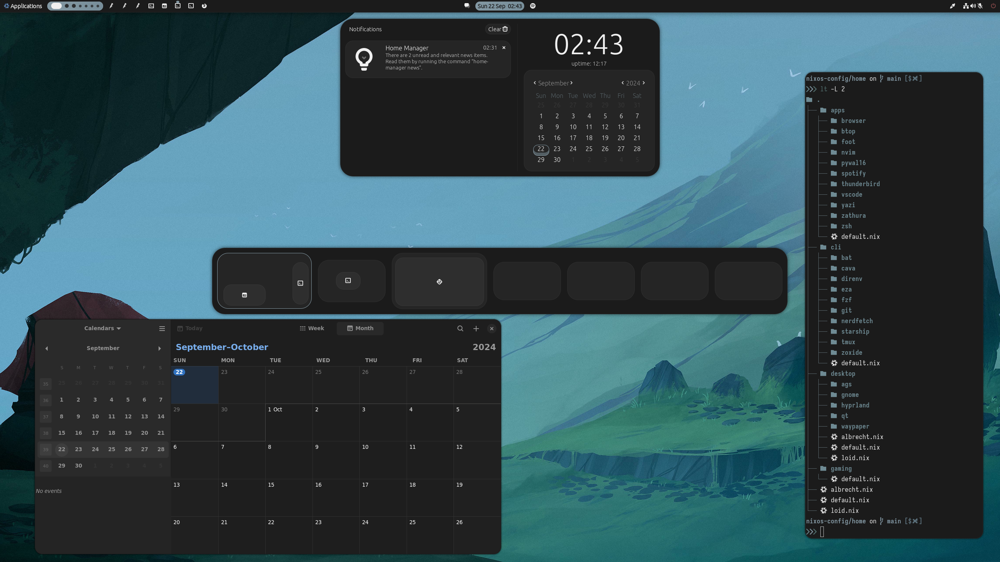

<h1 align="center">
    
     
      Nix Configs
</h1>

Personal NixOS and Home Manager configurations.

### 📸 Screenshots

    
    
    
    

### ⚙️ Configuration

| **Component** ||
| -------------- | --------------- |
| **Color Scheme** | Pywal 16 |
| **Sans Serif Font** | Ubuntu |
| **Monospace Font** | Iosevka |
| **Window Manager** | Hyprland |
| **Desktop Shell** | ags |
| **Terminal** | Foot |
| **Shell** | zsh |
| **Prompt** | starship |
| **Editor** | Neovim |
| **File Manager** | Yazi |
| **PDF Reader** | Zathura |
